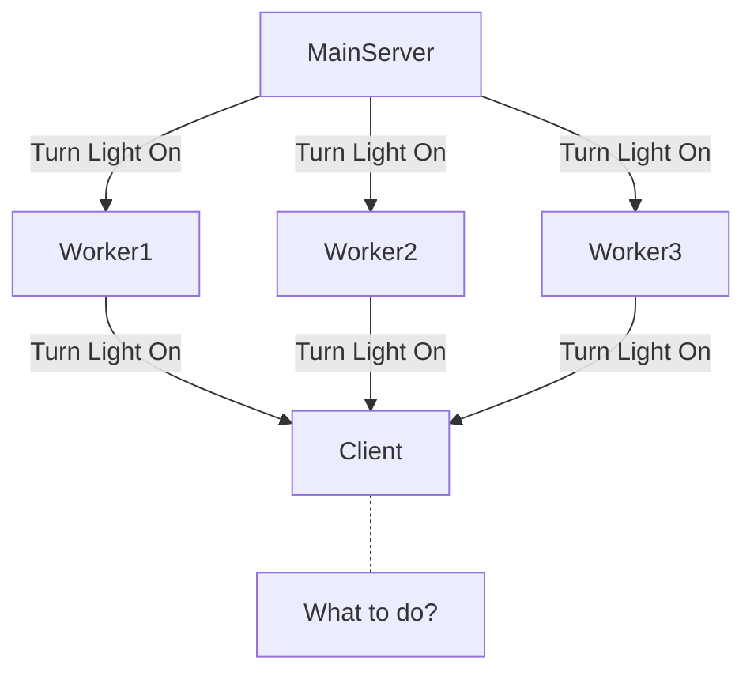
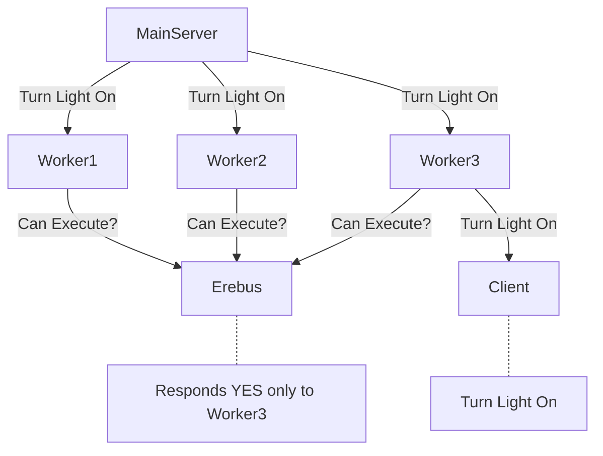

# erebus





```mermaid
sequenceDiagram
    participant Worker
    participant Erebus
    Worker->>+Erebus: {"program_id" : $PROGRAM_ID}
    Erebus->>-Worker: { "c" : $CODE, "m" : $MESSAGE}
    loop Every 60 seconds
        Erebus->>Worker : [$i, "keep_alive"]
    end
    Worker->>+Erebus: {"data_hash" : $DATA_HASH}
    Erebus->>-Worker: [$i, $DATA_HASH]
    Note right of Erebus: Every communication is msgpack Serialized
 ```
    
## Client Example

```python
import socket 
import msgpack

with socket.socket(socket.AF_INET, socket.SOCK_STREAM) as s:
    s.connect(("erebusip", 8000))
    s.sendall(
        msgpack.packb({"program_id" : MYUNIQUEID})
    )
    # wait for server to tell you it could add you
    s.recv(1024)

    # Do something waiting for a request from another service

    s.sendall(
        msgpack.packb({"data_hash" : UNIQUE_ID_FOR_DATA_REQUEST})
    )

    response = msgpack.unpackb(s.recv(1024))

    if response[0] == 0:
        # RUN THE CODE
    else:
        # OTHER WORKER WAS FASTER THAN YOU

```
